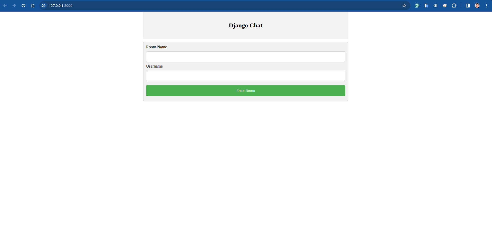

# Realtime Chat Application with Django

This project is a realtime chat application built using Django, a Python web framework. The application allows users to engage in conversations in real time, providing a seamless communication experience.



## Table of Contents
- [Introduction](#introduction)
- [Features](#features)
- [Installation](#installation)
- [Usage](#usage)
- [Contributing](#contributing)
- [License](#license)

## Introduction

In today's digital era, realtime communication is crucial for various applications ranging from team collaboration to customer support. This project aims to provide a robust solution for building a realtime chat application using Django, a popular web framework in the Python ecosystem.

## Features

- **Realtime Messaging**: Users can exchange messages in real time without needing to refresh the page.
- **User Authentication**: Secure user authentication system to ensure privacy and security.
- **Message History**: Users can view the history of their conversations.
- **Multiple Chat Rooms**: Support for creating and joining multiple chat rooms.

## Installation

To run this application locally, follow these steps:

1. Clone this repository:

    ```bash
    git clone https://github.com/luisrpavanelli/chat-application-py-django.git
    ```

2. Navigate to the project directory:

    ```bash
    cd chat-application-py-django
    ```

3. Install the dependencies:

    ```bash
    pip install -r requirements.txt
    ```

4. Set up the database:

    ```bash
    python manage.py migrate
    ```

5. Start the development server:

    ```bash
    python manage.py runserver
    ```

6. Access the application in your web browser at `http://localhost:8000`.

## Usage

1. Register for a new account or log in if you already have one.
2. Create or join a chat room.
3. Start sending and receiving messages in real time.
4. Explore other features such as message history and notifications.

## Contributing

Contributions are welcome! If you'd like to contribute to this project, please follow these steps:

1. Fork the repository.
2. Create a new branch (`git checkout -b feature/your-feature-name`).
3. Make your changes.
4. Commit your changes (`git commit -am 'Add some feature'`).
5. Push to the branch (`git push origin feature/your-feature-name`).
6. Create a new Pull Request.

## License

This project is licensed under the [MIT License](LICENSE). Feel free to use, modify, and distribute this code for both commercial and non-commercial purposes.
